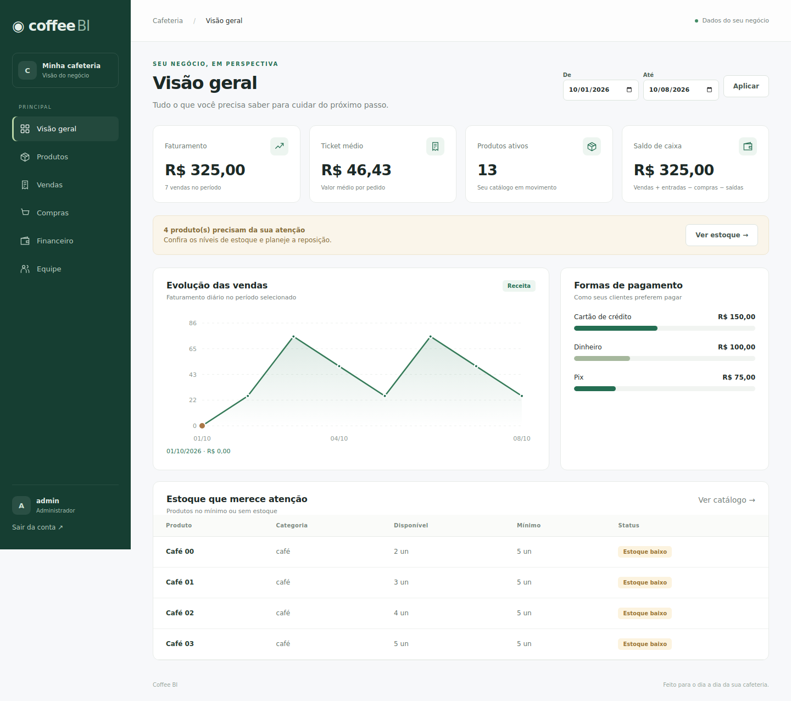

# Coffee BI

Gestão de cafeteria com catálogo, estoque, vendas, compras, equipe, financeiro e indicadores. A interface web em FastAPI é a entrada recomendada. O Streamlit original continua disponível e compartilha o banco e os serviços corrigidos.



## Executar a nova interface

Python 3.12 ou 3.13:

```bash
python -m venv .venv
```

Ative o ambiente no Windows:

```powershell
.venv\Scripts\Activate.ps1
```

Ou no Linux/macOS:

```bash
source .venv/bin/activate
```

Instale e configure:

```bash
python -m pip install -r requirements-api.txt
```

Copie `.env.example` para `.env`. Configure `ADMIN_PASSWORD` com uma senha própria de ao menos 6 caracteres e no máximo 72 bytes UTF-8. O administrador só é criado quando essa variável está preenchida e ainda não existe um usuário com `ADMIN_USERNAME`.

```bash
python -m uvicorn api.main:app --reload
```

Abra **http://127.0.0.1:8000**. Documentação interativa: **http://127.0.0.1:8000/docs**.

- `DATABASE_URL` mantém o SQLite padrão ou aponta para PostgreSQL. URLs `postgres://` e `postgresql://` usam explicitamente o driver psycopg2 instalado.
- Para reutilizar dados, indique o mesmo banco da aplicação anterior. Um caminho SQLite absoluto evita abrir outro banco ao executar de uma pasta diferente.
- Usuários existentes mantêm suas senhas. Alterar `ADMIN_PASSWORD` não redefine uma conta existente.
- `CAIXA_USERNAME` e `CAIXA_PASSWORD` permitem criar opcionalmente um operador.
- `BUSINESS_TIMEZONE` controla as datas do negócio; padrão: `America/Sao_Paulo`.
- Use `COOKIE_SECURE=true` em HTTPS.

**Dados de demonstração são opcionais:** após configurar o `.env`, execute `python init_db.py`. Esse comando adiciona o catálogo e funcionários de exemplo de forma idempotente. Não cria vendas fictícias. Para criar apenas as tabelas e os usuários configurados, use `python init_db.py --no-examples` ou inicie a API normalmente.

## Rotas e comportamento

| Recurso | GET | POST | PUT | DELETE |
|---|---|---|---|---|
| `/api/products` | Lista paginada; `/{id}` detalha | Cria produto | `/{id}` edita, com `If-Match` | `/{id}` desativa |
| `/api/employees` | Lista; `/{id}` detalha | Cria funcionário | `/{id}` edita | `/{id}` desativa e revoga o acesso vinculado |
| `/api/transactions` | Lista; `/{id}` detalha | Cria lançamento | `/{id}` edita | `/{id}` exclui |
| `/api/sales` | Lista; `/{id}` detalha | Registra venda e baixa estoque | — | `/{id}` cancela e devolve estoque |
| `/api/purchases` | Lista; `/{id}` detalha | Registra compra e atualiza estoque/custo | — | `/{id}` cancela se houver estoque suficiente |
| `/api/auth/login` | — | Autentica e define cookie HttpOnly | — | — |
| `/api/auth/me` | Usuário atual | — | — | — |
| `/api/auth/logout` | — | Revoga sessão | — | — |
| `/api/dashboard` | Indicadores, série diária e formas de pagamento | — | — | — |
| `/api/health` | Verifica aplicação e conexão com banco | — | — | — |

Listas aceitam `page`, `page_size` (1–100), `sort`, `direction` e `q`. Produtos também aceitam `active=true/false`. A busca de vendas e compras usa o ID. O dashboard aceita `start` e `end` em formato ISO, em um período de até 366 dias.

**Edição concorrente de produtos:** a resposta traz `version`. Ao editar, envie esse valor no cabeçalho `If-Match`. Se outra venda, compra ou edição tiver alterado o produto, a API responde `409`; reabra a edição com os dados atuais. O frontend já faz isso automaticamente.

**Vendas/compras são movimentos fechados:** correções são feitas por cancelamento e novo registro. O total é calculado no servidor a partir de quantidade × preço, com `Decimal`; subtotais enviados por clientes não são aceitos pela API. Uma falha em qualquer item desfaz a operação inteira.

**Permissões:** o caixa consulta produtos e indicadores e registra/consulta vendas. Cadastro e edição de produtos, equipe, compras, financeiro e cancelamentos exigem administrador. As permissões são verificadas no backend.

## Banco existente e custos

Na inicialização, as tabelas novas são criadas e duas colunas são adicionadas se necessário: `produtos.version` e `itens_venda.custo_unitario`. Nenhuma tabela de negócio é apagada. Faça uma cópia do banco antes de atualizar uma instalação com dados reais. Inicie uma instância para aplicar a migração antes de subir múltiplos workers.

Novas vendas guardam o custo no momento do pedido. Vendas anteriores não têm esse histórico; o relatório usa o custo atual como estimativa para esses itens. O saldo de caixa considera vendas + entradas avulsas − compras − saídas avulsas; não representa lucro contábil. Não registre novamente vendas/compras como lançamentos avulsos, para evitar contagem duplicada.

O cancelamento de uma compra reverte a quantidade; mantém o custo médio vigente. A reavaliação contábil de estoque após devoluções não faz parte desse fluxo.

## Interface Streamlit

```bash
python -m pip install -r requirements.txt
python -m streamlit run app.py
```

Os serviços de venda, compra e estoque corrigidos também são usados nessa interface. O gerenciamento avançado de usuários e redefinição de senha permanece na tela **Funcionários**, com acesso de administrador.

## Validar

```bash
python -m pip install -r requirements-dev.txt
python -m pytest -q
python -m playwright install chromium
python tests/browser_smoke.py
```

Os testes usam bancos temporários; o teste de navegador inicia seu próprio servidor. Para testar PostgreSQL, configure `COFFEE_TEST_DATABASE_URL` **exclusivamente com um banco descartável**, pois as tabelas desse banco são recriadas. Nunca use o banco real nessa variável. A CI testa SQLite/PostgreSQL e Python 3.12/3.13.

O teste de navegador percorre o CRUD com requisições reais, recarrega a página para verificar persistência, verifica feedback de estoque insuficiente, paginação, ordenação, gráficos, layout móvel e logout. Capturas ficam em `docs/screenshots/`.

Detalhes da auditoria e limites da validação: [docs/AUDITORIA.md](docs/AUDITORIA.md).

Para verificar também a interface anterior, com `requirements.txt` instalado:

```bash
python tests/streamlit_smoke.py
```
